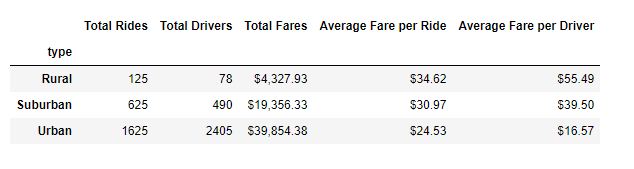
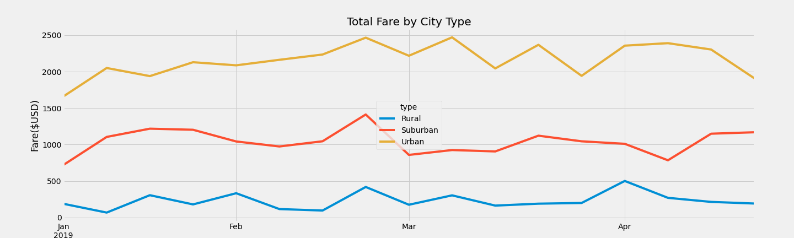

# PyBer_Analysis
## Overview of the analysis
As a data analysis for Pyber, a Python based ride-sharing app company, valued at $2.3 billion. I have been assigned to a new   project by CEO V. Isualize to analyze all the rideshare data from January to early May of 2019 and create a summery DataFrame of the ride sharing data by city type.

Further, Pandas and Matplotlib have been used to create multiple line graph that shows the total weekly fares for each city type.

## Results

### Differences in ride-sharing data among the different city types

#### Summery dataframe  for ride sharing data among different city types.

 

  - Considering above dataframe we can say follwing.
   -  City type "Rural" has minimum Total Rides, Total Drivers and Total Fares comparing to othger two city types. 
   -  City type "Urban" has highest number of Total Rides, Total Drivers and Total Fares.   
   -  The Average Fare per Ride is concerned, the "Rural" city type has the highest fare ($34.62) while "Urban" has the lowest ($24.53). The differance is slightly over than $10 between Rual and urban city types. Average Fare per Ride differance between Rural and Suburban is $3.65 while observed $6.44 differance between Suburban and Urban.
   -	The Average Fare per Drivers is concerned, the lowest fare is for "Urban" ($16.57) and highest is for "Rural" ($55.49). Average Fare per Dribvers valune for Rural is little over 3 times higher than the value for "Urban". 
   -	

#### Multiple line chart for weekly fare (from Jan Apr) among different city types

 - At glance in line chart, we can say urban cities has highest fare and rural cities has lowest fares with each weeks peaks or drops.
 - Considering all 3 city types we can say beginning of February 3rd week all 3 city types has highest ride fare.

## Summery
 - Not enough total drivers in rural cities considering total rides vs drivers.
 - When considering total rides and drivers we can see there is not enough drivers for rural cities.
 - Better to decrease average fare per Driver amount in rural cities and increase the number of drivers
